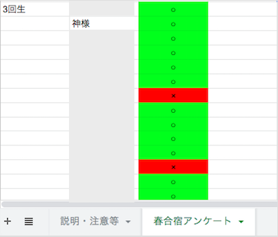

# CAconfirm
## 前準備
- Node.jsのインストールとnpmコマンド
- clasp
- (任意の)ブラウザ
- Googleアンケートとそのスプレッドシート
- スプレッドシート(氏名一覧を載せた名簿)

## 用途
アンケートを答えたということを本人が忘れることがしばしばある。  
アンケート答える人が作成した人にわざわざ聞かれては面倒なことである。  
そのようなことを防止するためにも回答者が自分で確認できるシステムを作った。  
予めスプレッドシートに氏名を載せた名簿を用意しておき、答えたか否かを *色と記号を使い可視化すること* を目的としている。  
  
上図のように灰色の四角(氏名は隠しています)に名前を載せ、アンケートの氏名等を判断材料とし、氏名と回答を結びつけてデザインするようにしています。  
なお、 **送信ボタンをトリガーにしているため、自動的に更新されます。** (誰かが送信した地点で更新がかかります。)

## 準備
### 環境変数
既にスクリプトがある場合は、`.clasp.json`ファイルが生成される必要がないため、scriptIDを控えておいてください。  
`.clasp-templete.json`というテンプレートを用意しているので、そこにscriptIDを入力してrenameしてください。以下のコマンドを実行。もともとある場合は自身の`.clasp.json`を削除しても構いません。  
`rm .clasp-templete.json .clasp.json`
### scriptIDの確認の仕方
GASのスクリプトページの、`「ファイル」 > 「プロジェクトのプロパティ」`のプロパティ欄にスクリプトIDが記載されていると思います。

## 実行方法
