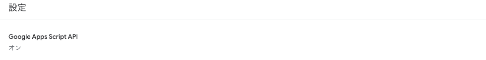
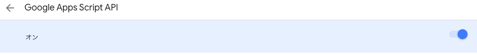
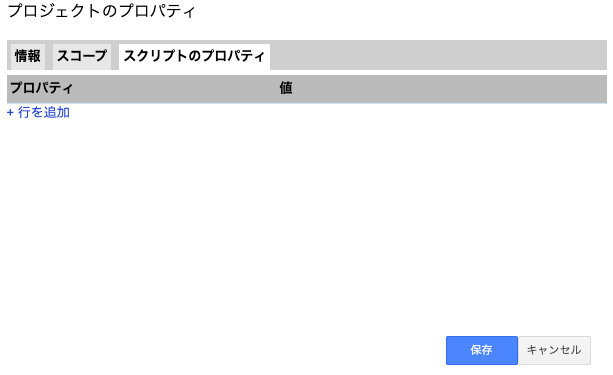
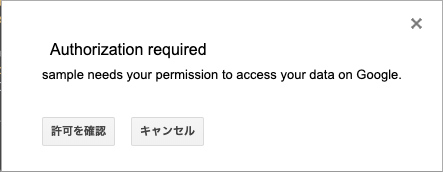
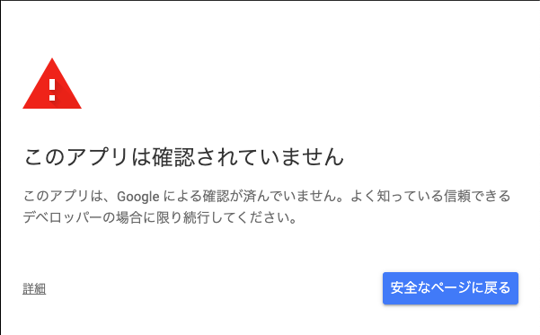

# CAconfirm
## 前準備
- Node.jsのインストールとnpmコマンド
- clasp
- (任意の)ブラウザ
- Googleアンケートとそのスプレッドシート
- スプレッドシート(氏名一覧を載せた名簿)

## 用途
アンケートを答えたということを本人が忘れることがしばしばある。  
アンケート答える人が作成した人にわざわざ聞かれては面倒なことである。  
そのようなことを防止するためにも回答者が自分で確認できるシステムを作った。  
予めスプレッドシートに氏名を載せた名簿を用意しておき、答えたか否かを *色と記号を使い可視化すること* を目的としている。  
  
上図のように灰色の四角(氏名は隠しています)に名前を載せ、アンケートの氏名等を判断材料とし、氏名と回答を結びつけてデザインするようにしています。  
なお、 **送信ボタンをトリガーにしているため、自動的に更新されます。** (誰かが送信した地点で更新がかかります。)

## 準備

### scriptIDの確認の仕方
GASのスクリプトページの、`「ファイル」 > 「プロジェクトのプロパティ」`のプロパティ欄にスクリプトIDが記載されていると思います。

### node_moduleのインストール
```
node -v
npm -v
```
上記のコマンドをターミナルに入力する。  

#### バージョンが出力されない人向け
- [nodebrewで入れる方法](https://fukatsu.tech/install-nodejs#Nodejs)
- [ホームページから持ってくる。](https://nodejs.org/ja/download/)LTSを選択しよう。  
その上で以下へ。
#### バージョンが出力された人向け
以下のコマンドを実行。
```
npm i @google/clasp -g  # グローバルにclasp環境を整える。
npm i #ローカルに必要なNodeModuleをインストール。
```

### Googleアカウントの設定
Webエディタにアップロードするためにユーザ認証が必要なので、
`clasp login`を実行し、webページでログインを行う。

### GASのAPI設定
[このページ](https://script.google.com/home/usersettings)より、以下の通りに**on**にする。このとき、使用するアカウントでログインしていることを確認する。




## プロジェクトの作成

```
clasp create --type standalone --rootDir ./dist --title "sample"
```
オプションについては[こちら](https://github.com/google/clasp#options-1)を参照。  
オプションは付与しない又は順不同で構わないが、`--rootDir`オプションだけは必ずつけること。  
実行時以下のエラーが出た場合は、その設定を出来ていないためです。`.clasp.json`のscriptIDの下に`"rootDir": "./dist"`と記述しましょう。  


## ビルド方法
```
npm run build
clasp push
```
上記のように実行すると、ビルド・ts→jsにトランスパイルされ、クラウドにソースコードが転送される。  
上記２行を以下の1行でかける。
```
npm run deploy
```

### プログラムのテストを行う場合
```
npm run test
```
`clasp open`でクラウドに上げたソースコードをブラウザで確認できる。

## プロパティの設定
ブラウザに遷移したら次のことを行う。
このプロジェクトでは以下の４つのプロパティを使用する。
- GF_URL
  - Googleフォーム
- SS_FOR_EVERYONE_URL
  - 公開用スプレッドシート
- SS_MENBERS_URL
  - メンバーの情報を載せたスプレッドシート
- EVENT_TITLE
  - 任意の行事  

上記のプロパティを設定するために`「ファイル」> 「プロジェクトのプロパティ」 > 「スクリプトのプロパティ」`を選択し、「行を追加」でプロパティを設定する。  
ex) GF_URL : https://google.sample  
  

## 実行方法
実行できるが、プロジェクトを作成して初めて実行する場合は承認が必要である。  
  
許可するとGoogleアカウントを選択する画面に遷移するので、`clasp login`のときにログインした時のアカウントを選択する。　　

  
次に詳細を押し、「安全でないページ」へ遷移する。  
また許可を求められるので「許可」を選択。  
ようやく元の画面に戻るので、`⌘R`で実行する。

## claspについて
GoogleがGASをローカルで開発できるように作成した[ライブラリ](https://github.com/google/clasp#deploy)です。  
今回はそのライブラリのテンプレートを作成した[gas-clasp-starter](https://github.com/howdy39/gas-clasp-starter)というものを活用しています。  
参考記事: https://qiita.com/howdy39/items/0e799a9bfc1d3bccf6e5
